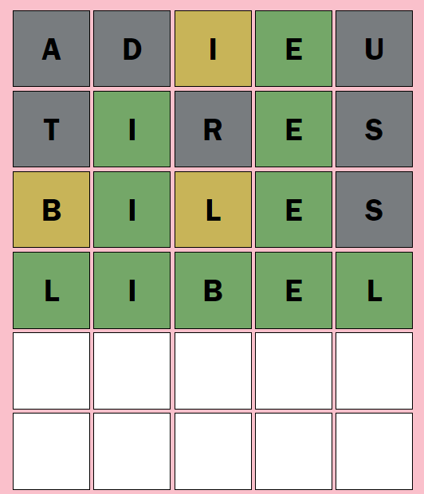
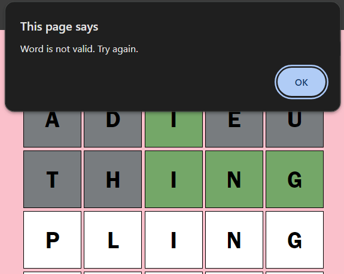
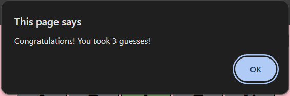

# Wordle

This project is an online copy of the New York Times game Wordle. The technologies used are HTML, CSS, and JavaScript. It includes all the game functionalities of the original game but is meant to be replayable with no user accounts, success stats or replay timeout.

Players will have **up to 6 guess** to determine the five-letter word of the day. They are given feedback for each guess made in the form of colored tiles.

## Rules & Instructions

1. Begin typing a five-letter word using your keyboard. When you are ready to make a guess, hit the 'Enter' button on your keyboard.
2. Different coloured tiles will appear based on your guess.

| Tile Colour | Meaning of Colour
| :---: | ---
| 🟩 | If the tile turns *green*, that letter is **in the word** and is in the **correct spot**. 
| 🟨    | If the tile turns *yellow*, the letter is **in the word** but is in the **wrong position**. 
| ⬜ | If the tile turns *grey*, the letter is **not in the word**.
3. Continue making guesses based on the feedback you receive until you either get the word of the day or run out of guesses.
4. To play again, refresh the page for a new Wordle.

## Design

The overall designs for the game can be found at: [Design System](docs/design_system.md).

## In-game Screenshots
As a user plays the game, they will receive pop-up messages and feedback, in terms of coloured tiles, based on the words they guess.

When a user makes a **valid guess**, the grid will display the appropriate feedback through coloured tiles.

When a user **guesses a word that does not exist**, they receive the following message:

When the user **correctly guesses a word**, they receive a congratulations message as well as how many guesses it took them.

## References
- The raw .txt file containing all possible Wordle answers was uploaded by GitHub user [Garrett Scholtes](https://gist.github.com/scholtes). This list of words used can be found at [Wordle dictionary](https://gist.github.com/scholtes/94f3c0303ba6a7768b47583aff36654d).
- The list of valid five-letter guesses came from GitHub user [Matthew Somerville](https://gist.github.com/dracos). That file used can be found at [valid-wordle-words.txt](https://gist.github.com/dracos/dd0668f281e685bad51479e5acaadb93).
