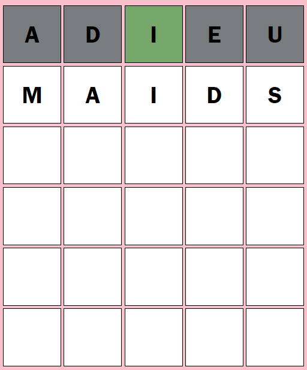

# Design System
This document outlines the design system for the project.

## Fonts
- **Primary Font:** Franklin Gothic Medium

## Colours
- **Correct Tile Colour:**  `#6ca965` (Green)
- **Not in Correct Tile Colour:** `#c8b653` (Yellow)
- **Not in Word Tile Colour:** `#787c7f` (Gray)
- **Font Colour:** `#000000` (Black)
- **Intial Tile Background Colour:** `#ffffff` (White)

## Header
Similar to the original Wordle, the name of the game is displayed in the top-center of the screen.

## Play Area
Players use the grid to type their guess. As they type, a letter will appear in each square.
In this grid, user's will make their guess(es) and receive feedback on the guess.

